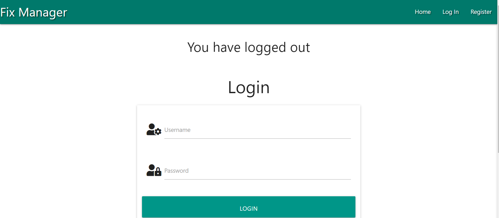
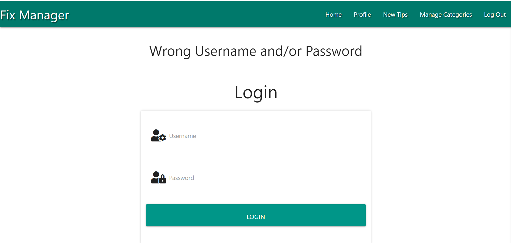
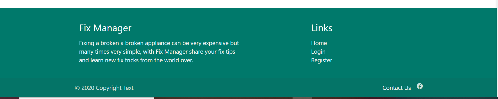

# *Fix Manager*

Getting a technician to come fix a simple broken appliance or furniture in homes are most times costly and time wasting,  **Fix Manager** is a platform where people can share and learn basic tips to fix their home appliances and furniture. Tips are allowed to be update, deleted and pictures uploaded.

## UX

### User Experience Goals

* Help people learn and share tips to fix their broken home appliances.
* Users will be able to create a profile, using a personalized username and password for authentication.
* Users will be able to update, edit and delete tips shared at anytime of their choice.

### UX Process

* A logged-in user would be able to see the necessary navbars to create a fix tip, profile, homepage where the general tips from all users are displayed and to also log-out.

* Users are only allowed to edit their personal tips without access to edit or delete the general public tips.

* Only the admin has access to add, edit and delete the categories with the public exempted from this functionality.

#### Project Method:
The method use in the project are primarily acquire from the Code Institute Fullstack Software Development Course modules in HTML, CSS, JavaScript, Python Essentials and Backend Development particularly the All Task mini project Example. It is worthy of mention that I have studied other software development free materials, courses on Udemy, snippet codes, templates and Video tutorials on YouTube.

## FEATURES

1. Navbar: Allows users to navigate to different options within the platform.

1. Register: Users allow to create a profile with a username and password of their choice for authentication.

1. Login: Users can login to the platform after creating the profile with details used when creating their profile.

1. Tips/Homepage: All users can see the general tips posted by all users, with their names and dates when repair tips were added.

1. Add Tips: All users can add their repairs tips using category options and heading of the tips they which to share. They can also upload pictures for others users to follow.

1. Tips Search: A search options is allowed for quick access using name and description for all users.

1. Category Add/Delete Limitations: Only the Admin is allowed to manage/add categories or Delete Categories with access blocked to general users.

1. Delete Defensive Coding: To delete any tips or category users are allow to re-consider and confirm delete action.

1. Log Out: Users can log out of their profile with a log out message desplayed to confirm action.

1. Wrong Login Details: Wrong log in details alerts the users without suggesting what is wrong between username and password.

1. Footer: A footer with return links to Homepage, Login and Register. With a link to contact through a social media account.

## Technology used

### Programming Languages:
* HTML
* CSS
* JAVASCRIPT
* PYTHON

### DataBase

* MongoDB

### Libraries
* Font Awasome  For icons.
* Materailizecss For source codes and styling.
* Jinja Framework Used for template execution and code re-usability.
* jQuery To simplify DOM manipulation.

## Testing

The tools were used for testing for code validation and beauty purpose:

* Freeformatter used to beautify the HTML code.
* BeautyTools used to beautify and validate the Javascript and CSS codes.
* Sentry trial version to debbug python scripts for error.

Navigation bars and buttons on this website has been tested, navigations all links to indended pages and the buttons functions as intended. The authentication requires a username and password to login, giving access to more functionalities and pages such as user profile, only the admin can update or delete a category. This website database uses mongoDB and all the endpoints created to carry out CRUD operations works properly; registered users of this website can create, read, update and delete data in the database as expected.

### Limitations

* User profile can be better with more options for personal details, password reset and option to delete profile by users that wishes to exit platform.
* A video upload will be better for users, to see tips givien being practicalised.
* A live chat will be a great addition to help users having problems on the platform.

### Deployment

Fix Managers is deployed on Github, connected to Heroku with automatic update with every Git Push. Necessary Files required by Heroku such as Procfile and requirements.txt have been added and sensitive folders gitignored.
GitHub is selected as the method during deployment to build and generate url.

#### Github url: 
* https://github.com/Tayo-bet/Fix-Tips

#### Heroku url:
* https://fixtips.herokuapp.com/

### Credits:

* This project draws inspiration from Code Institute Mini Project Example during backend development module.
* https://www.youtube.com/watch?v=6WruncSoCdI&t=13s Was used as additional lessons for image upload in Flask.
* https://www.youtube.com/watch?v=zMhmZ_ePGiM&t=252s Was used as additional lessons for image upload in Flask.

#### Acknowlegment:
Special thanks to My Mentor Dick Vlaanderen for guidance and direction from my first mile-stone Project all through till now.

##### Note Code Institute:
* Username: Admin
* Password: Baba312