# *Fix Manager*
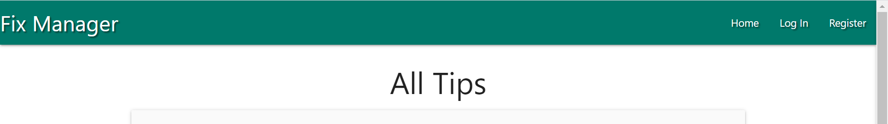

Getting a technician to come fix a simple broken appliance or furniture in homes are most times costly and time wasting,  **Fix Manager** is a platform where people can share and learn basic tips to fix their home appliances and furniture. Tips are allowed to be update, deleted and pictures uploaded.

## UX

### User Experience Goals

* Help people learn and share tips to fix their broken home appliances.
* Users will be able to create a profile, using a personalized username and password for authentication.
* Users will be able to update, edit and delete tips shared at anytime of their choice.

### UX Process

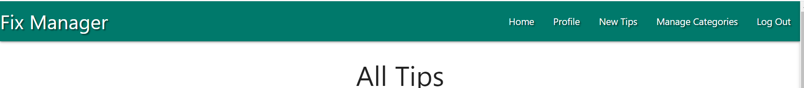
* A logged-in user would be able to see the necessary navbars to create a fix tip, profile, homepage where the general tips from all users are displayed and to also log-out.

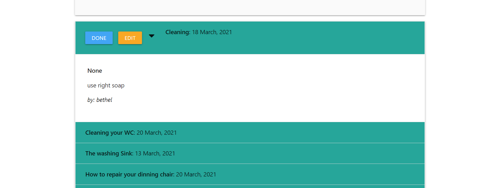
* Users are only allowed to edit their personal tips without access to edit or delete the general public tips.

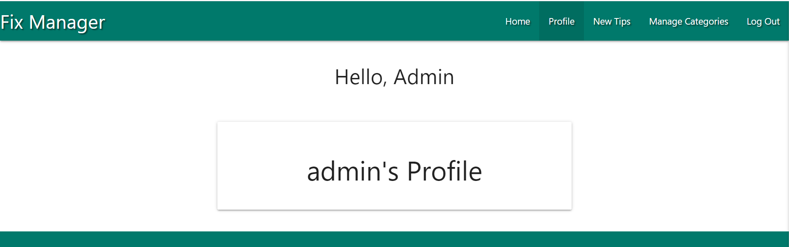
* Only the admin has access to add, edit and delete the categories with the public exempted from this functionality.

#### Project Method:
The method use in the project are primarily acquire from the Code Institute Fullstack Software Development Course modules in HTML, CSS, JavaScript, Python Essentials and Backend Development particularly the All Task mini project Example. It is worthy of mention that I have studied other software development free materials, courses on Udemy, snippet codes, templates and Video tutorials on YouTube.

## FEATURES

1. Navbar: Allows users to navigate to different options within the platform.

1. Register: Users allow to create a profile with a username and password of their choice for authentication.

1. Login: Users can login to the platform after creating the profile with details used when creating their profile.
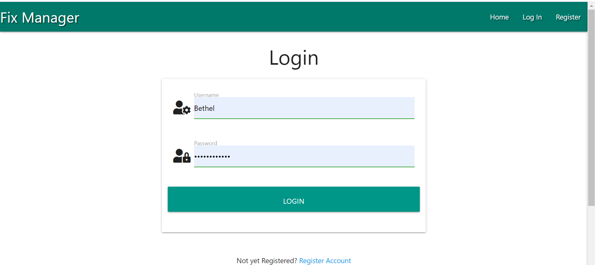

1. Tips/Homepage: All users can see the general tips posted by all users, with their names and dates when repair tips were added.
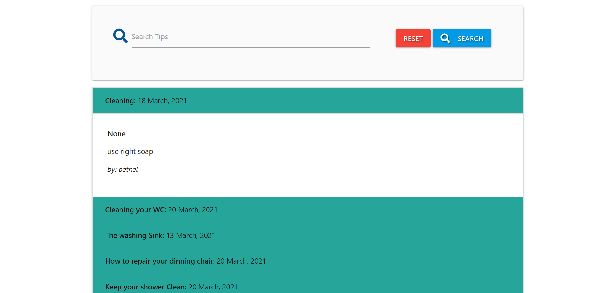

1. Add Tips: All users can add their repairs tips using category options and heading of the tips they which to share. They can also upload pictures for others users to follow.
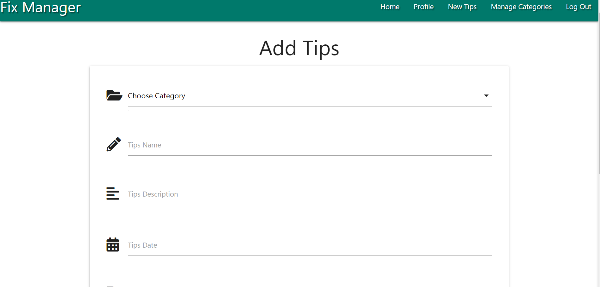
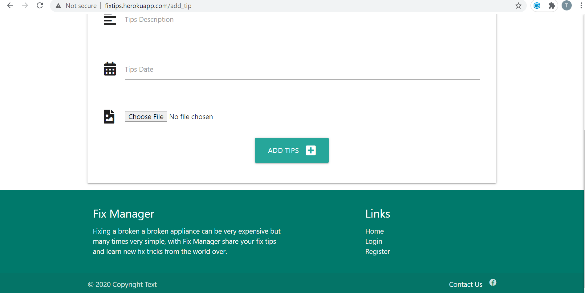

1. Tips Search: A search options is allowed for quick access using name and description for all users.
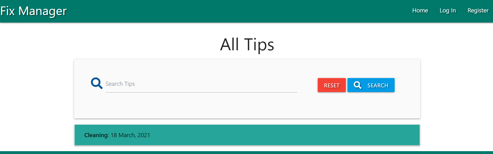

1. Category Add/Delete Limitations: Only the Admin is allowed to manage/add categories or Delete Categories with access blocked to general users.
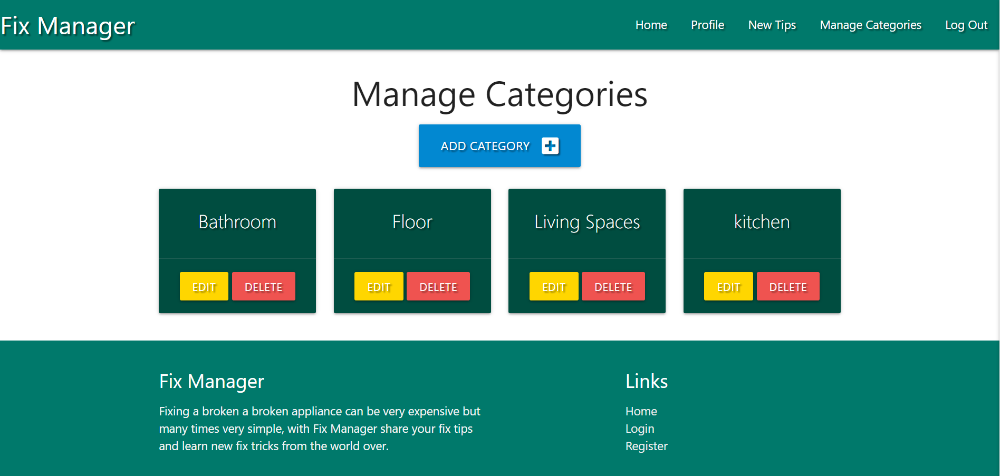

1. Delete Defensive Coding: To delete any tips or category users are allow to re-consider and confirm delete action.
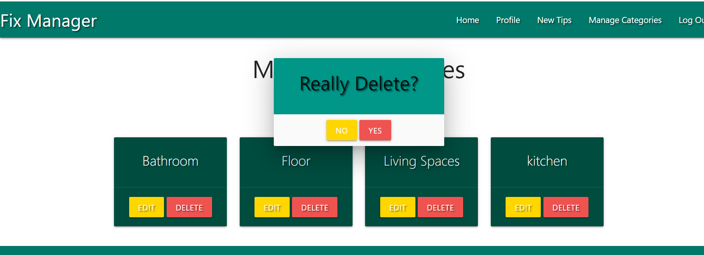
