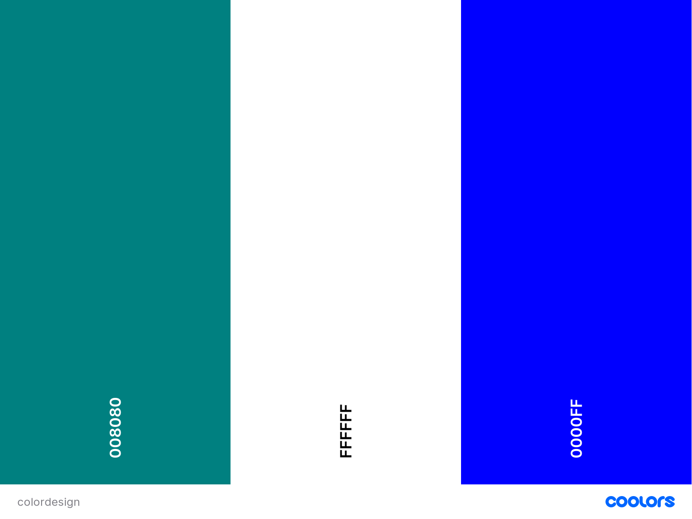
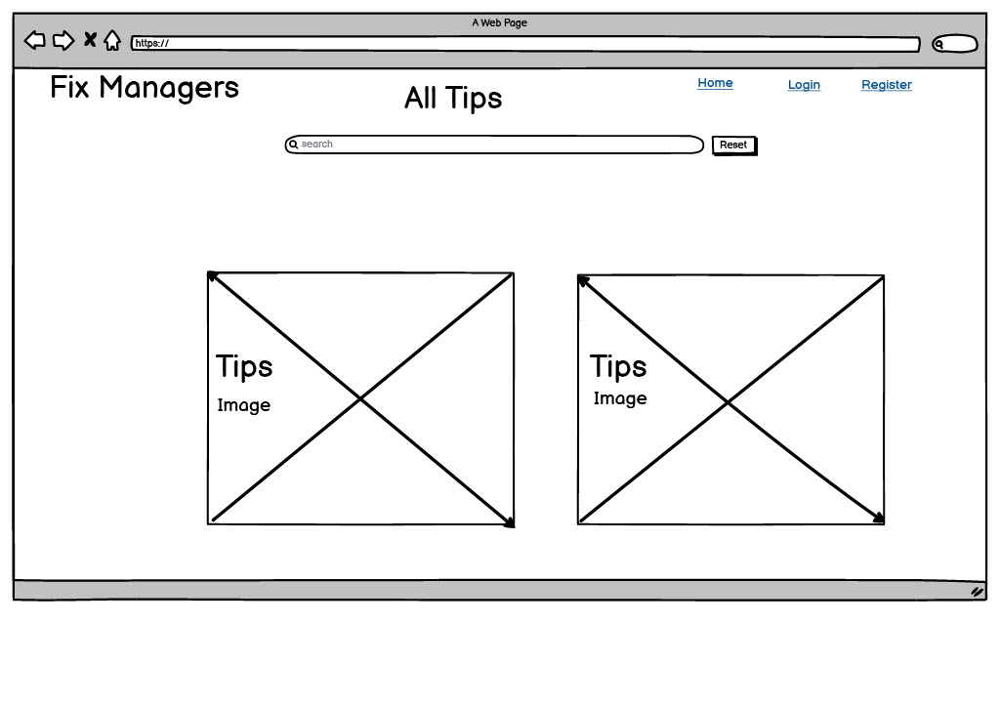
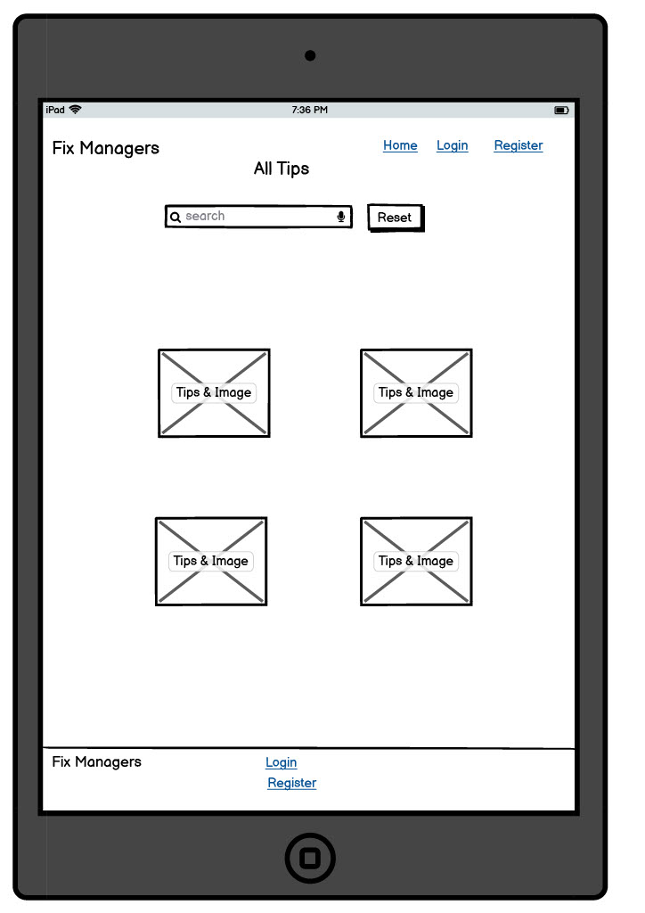
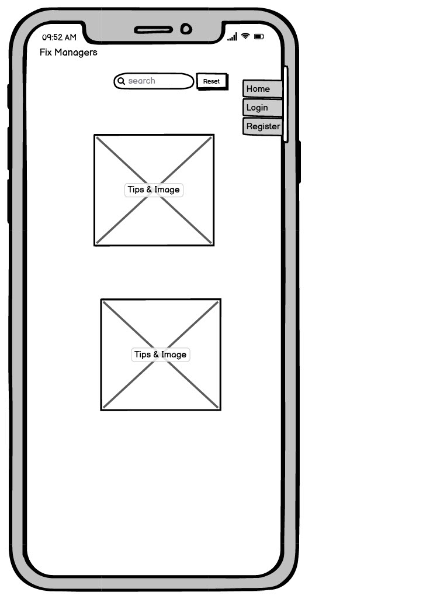
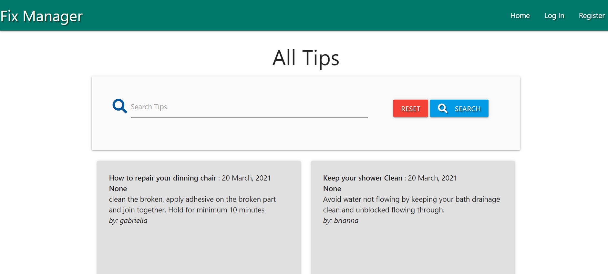
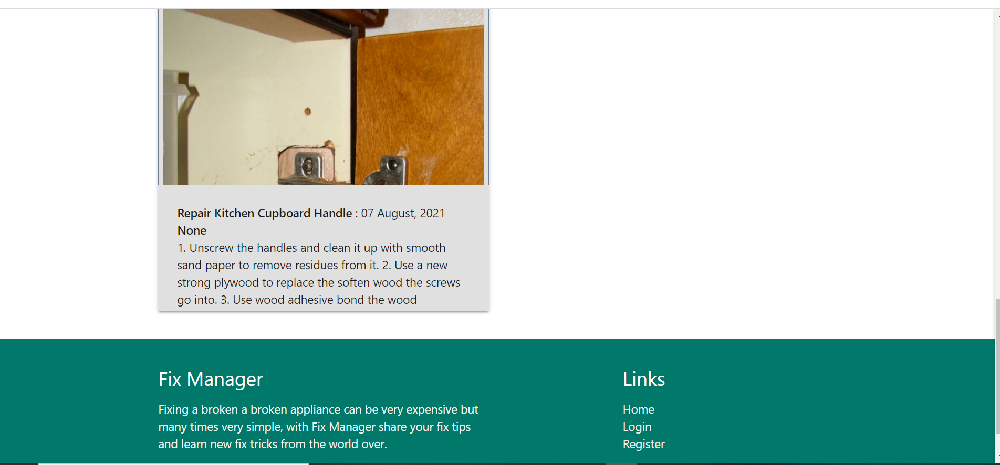

# *Fix Manager*

**Fix Manager** is a platform where people can share and learn basic tips to fix their home appliances and furniture. Tips are allowed to be update, deleted and pictures uploaded.

## UX

### Users Goal

* To help users make simple and normal repairs in their homes.
* To allow users avoid the waiting long waiting times it takes to get technicians.
* Help users cut expenses by trying to make repairs through tips and images share by other users.
* Give users the opportunity to share their own experience with repairs of their own too.

### Business Goals

* To create a platform where by sharing repair ideas companies can advertise their house products and thereby generate income for the platform.

* To create a platform to generate marketing database for relevant companies in marketing and research purposes.

### User Story

#### Persona

* Mike mistakenly broke the handle to his kitchen cupboard, it is still new and does not want to buy a new one. He called up a carpenter who wants to charge him almost the amount to buy a new one
and can only come after 10days due to work load. Mike called a friend that tells him about Fix Manager, a platform where he can get tips about how to make repairs to home appliances and furniture.
Mike visits the platform and:

* Register to get an account.
* Checks the different categories.
* Searches for relevant tips relating to what he wants.
* Applies the tips he say the platform.
* Follows the examples in the pictures.

After Making the repairs Mike decided to share his experience with other users by:

* Creating a sharing his own tips with updates of additional informations that will help others do it better and faster.

* He upload pictures of the his repairs too.

## Design Choice

### Fonts

* Sans Serif
* Pacifico

### Colour

## Wireframes

### Desktop View

### Tablet View

### Mobile View

## FEATURES

* Navbar: Allows users to navigate to different options within the platform.

* Register: Users allow to create a profile with a username and password of their choice for authentication.

* Login: Users can login to the platform after creating the profile with details used when creating their profile.

* Tips/Homepage: All users can see the general tips posted by all users, with their names and dates when repair tips were added.

* Add Tips: All users can add their repairs tips using category options and heading of the tips they which to share. They can also upload pictures for others users to follow.

* Tips Search: A search options is allowed for quick access using name and description for all users.

* Category Add/Delete Limitations: Only the Admin is allowed to manage/add categories or Delete Categories with access blocked to general users.

* Delete Defensive Coding: To delete any tips or category users are allow to re-consider and confirm delete action.

* Log Out: Users can log out of their profile with a log out message desplayed to confirm action.

* Wrong Login Details: Wrong log in details alerts the users without suggesting what is wrong between username and password.

* Footer: A footer with return links to Homepage, Login and Register. With a link to contact through a social media account.

## Technology used

### Programming Languages:
* HTML
* CSS
* JAVASCRIPT
* PYTHON
* HEROKU
* MONGODB

### DataBase

* MongoDB

### Libraries
* Font Awasome  For icons.
* Materailizecss For source codes and styling.
* Jinja Framework Used for template execution and code re-usability.
* jQuery To simplify DOM manipulation.

## Testing

The tools were used for testing for code validation and beauty purpose:

* Freeformatter used to beautify the HTML code.
* BeautyTools used to beautify and validate the Javascript and CSS codes.
* Sentry trial version to debbug python scripts for error.

I carried out the following checks to test the website:

* I clicked the Navigation bars and buttons on this website to ensure all links go to indended pages and the buttons functions as intended. 

* I checked that authentication requires a username and password to login.

* I checked to be sure that only the admin can update or delete a category. 

* I checked to be sure that users cannot delete tips that are not their own.

### Limitations

* User profile can be better with more options for personal details, password reset and option to delete profile by users that wishes to exit platform.
* A video upload will be better for users, to see tips givien being practicalised.
* A live chat will be a great addition to help users having problems on the platform.

### Deployment

Fix Managers is deployed on Github, connected to Heroku with automatic update with every Git Push. Necessary Files required by Heroku such as Procfile and requirements.txt have been added and sensitive folders gitignored.

I used the below command to secure my work by pushing them to the repository file that was created for the project on GitHub.

* git add -A
* git commit -m " text to represent what is being committed"
* git push

Below are the step I used to deploy on Heroku:
After creating account

* Clicked on Settings
* Reveal Configvars
* Assigned the appropriate values for the environment variables.

* I connected to Github on Heroku through the name of Repo through the setting on create new app.

Below are the steps I used to create database on MongoDB:

After creating an account;
* Through Collections create DataBase.
* Assigned what categories, tips and users.

#### Github url: 
* https://github.com/Tayo-bet/Fix-Tips

#### Heroku url:
* https://fixtips.herokuapp.com/

### Credits:

* This project draws inspiration from Code Institute Mini Project Example during backend development module.
* https://www.youtube.com/watch?v=6WruncSoCdI&t=13s Was used as additional lessons for image upload in Flask.
* https://www.youtube.com/watch?v=zMhmZ_ePGiM&t=252s Was used as additional lessons for image upload in Flask.

#### Acknowlegment:
Special thanks to My Mentor Dick Vlaanderen for guidance and direction from my first mile-stone Project all through till now.
